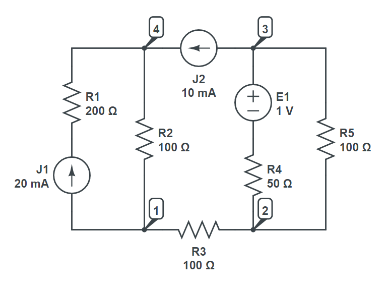

# CircuitSolver
Unique, object-oriented, linear electric circuit solver.
## Brief description
*CircuitSolver* allows you to programmaticaly solve linear circuits which consist of multiple components connected in series and parallel. Bridge topologies are unfortunately not supported. Component stands for any primitive linear two-terminal element including:
- resistor
- capacitor
- inductor
- impedance
- ideal voltage source
- ideal current source

or parallel and series circuit. In that way, electric circuit is modeled as a tree-like structure which can have arbitrary depth.

Both DC and AC modes are supported.
## Passive sign convention
When creating and connecting active components (that is voltage and current sources), one must follow [passive sign convention](https://en.wikipedia.org/wiki/Passive_sign_convention). This means that, given the reference direction of voltage and current, EMF or current of those active components which supply power to the rest of the circuit should be taken with negative sign. This boils down to two simple rules:
- EMF of an ideal voltage source is taken with negative sign if and only if its positive pole coincides with negative reference pole.
- Current of an ideal current source is taken with negative sign if and only if its direction is different that reference current direction.
## Example
Consider the following circuit:



Say we are interested in the current going through $E_{1}$. First, we instantiate all the elements.
``` csharp
using ElectricCircuitSolverCore.TwoTerminalComponents;
using ElectricCircuitSolverCore.TwoTerminalComponents.Abstract;

Resistor r1 = new Resistor("R1", 200),
    r2 = new Resistor("R2", 100),
    r3 = new Resistor("R3", 1),
    r4 = new Resistor("R4", 50),
    r5 = new Resistor("R5", 100);

IdealVoltageSource e1 = new IdealVoltageSource("E1", 1);
IdealCurrentSource j1 = new IdealCurrentSource("J1", 20, unit: 'm'),
    j2 = new IdealCurrentSource("J2", 10, unit: 'm');
```
Then, we model the circuit as a tree of series and parallel connections going from node 1 to 4. The binary operators & and | are overloaded to represent joining in series and parallel, respectively. Unary operator ~ is overloaded to represent reverse component's orientation. Take a moment to understand why it has been applied to $E_{1}$.
``` csharp
var b1 = j1 & r1;
var b2 = r4 & ~e1;
var b3 = r3 & (b2 | r5) & j2;

var circuit = b1 | r2 | b3;
```
To simulate the dynamics of the circuit, we essentially impose open-circuit between nodes 1 and 4 and specify that we are dealing with DC mode by setting angular frequency to zero. This changes the state of each component inside the circuit-tree. Finally, we are able to retrieve current at $E_{1}$.
``` csharp
circuit.ApplyCurrent(current: 0, omega: 0);

Console.WriteLine($"Current at {e1.Label}: {e1.Current.Real}A");
```
## How it works
Unlike many other conventional tools for simulating electric circuits which rely on solving linear systems of equations, *CircuitSolver* exploits polymorphism and hence is completely object-oriented. Each component follows the same interface, but behaves differently.

## Install NuGet package
The most convenient way to use the library is by installing [NuGet package](https://www.nuget.org/packages/uros7251.CircuitSolver.Core/1.0.0).